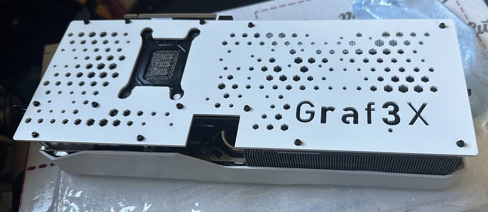
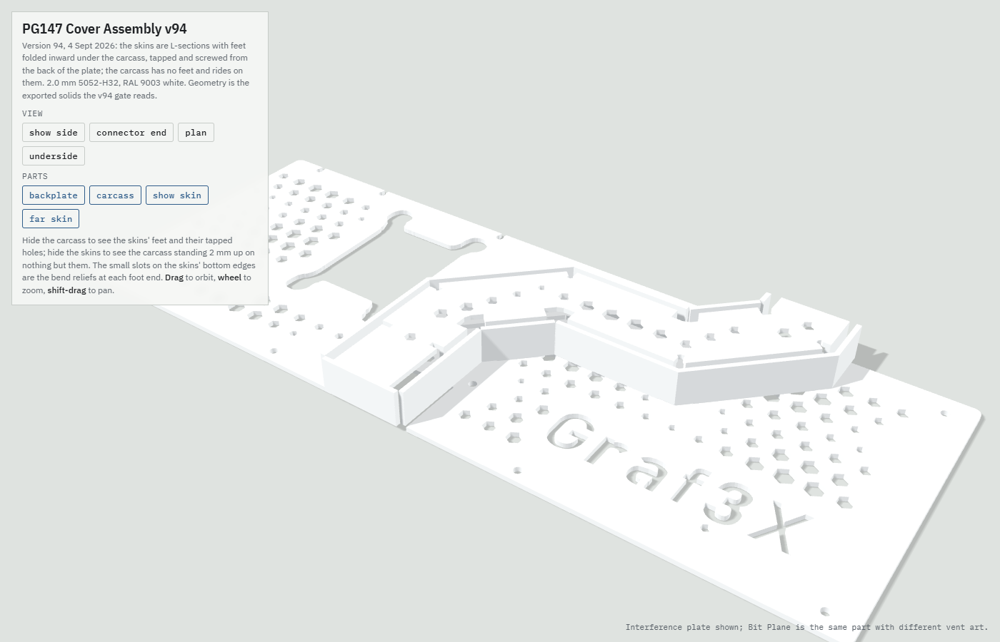
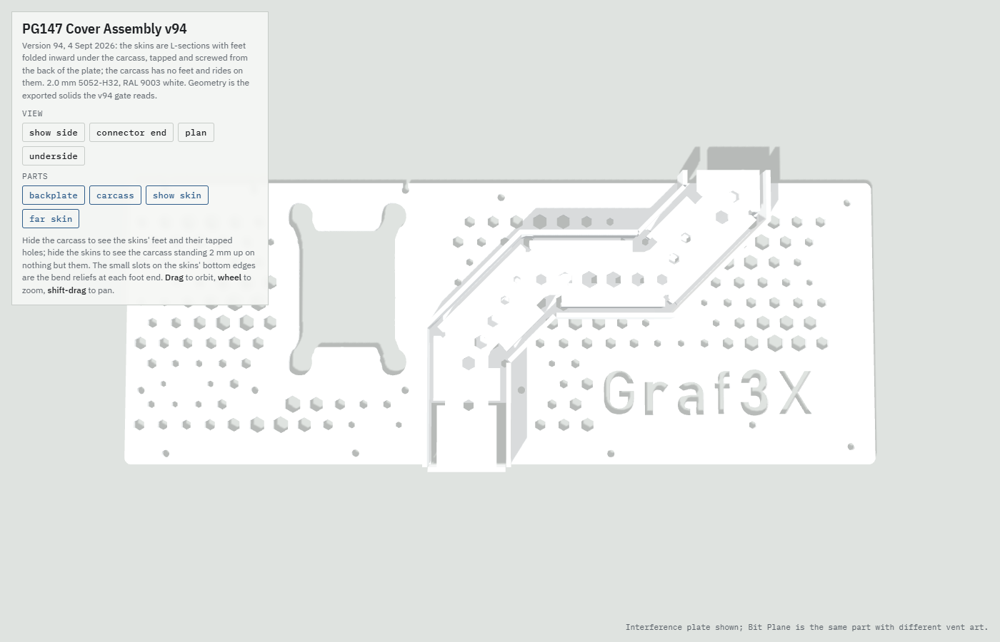

# PNY5080-Custom-Backplate

A white laser-cut backplate and a folded-metal cable cover for the **PNY GeForce RTX 5080 OC Triple Fan**. The 12V-2x6 power cable runs down a channel across the back of the card instead of sticking straight up out of the top.

Everything is generated from Python, and that python was FULLY vibe coded, make sure you use the test-prints on paper before you commit to getting something cut.  The cut files in this repo are the exact v94 files I ordered from SendCutSend, and the code rebuilds them to the micron. I take no liability if things do not line up for you. 

**The build story:** [Building a white, cable-hidden RTX 5080 with Claude](https://graf3x.github.io/PNY5080-Custom-Backplate/). How it went, including everything that didn't work.



|  |  |
|---|---|
| The v94 assembly | Plan view, with the vent field running under the channel |

---

## Read this before you cut anything

- **It fits one card.** The 13 screw holes were measured from a PNY RTX 5080 OC Triple Fan (`VCG508016TFXPB1-O`, board **PG147 SKU 45**) using 300 dpi flatbed scans and calipers. Other 5080s, including other PNY models, are different boards. If yours isn't this exact card, assume the holes are wrong until you've proven otherwise.
- **Print the paper templates first.** Lay them on your card. If every hole and edge doesn't line up on paper, it won't line up in metal. A sheet of printer paper costs about 1.4 cents. A plate costs about $68 for just the backplate (not the channel) and a week of shipping.
- **You are modifying a graphics card.** Taking the stock backplate off, re-padding and re-fitting are on you. No warranty of any kind comes with these files.

## What's in here

```
out/production_v94/upload/   the files you upload to SendCutSend, plus ORDER_SHEET_v94.txt
out/production_v94/          the same parts with notes drawn beside them, for reading
out/production_v94/templates_1to1_letter.pdf / _a4.pdf   paper templates, print at 100%
out/render_v94/              3D files of the assembly (GLB) for looking at
reference/v94-as-ordered/    a frozen copy of the exact files that were cut
cad/                         the Python that generates all of it
tools/print_templates.py     draws 1:1 templates from any folder of DXFs
tools/compare_dxf.py         checks two sets of cut files for identical geometry
```

## The parts

All five parts are **2.0 mm (0.080 in) 5052-H32 aluminium**, powder coated **RAL 9003 signal white**. Every part is over SendCutSend's 1 inch minimum for powder coat.

| File | What it is |
|---|---|
| `backplate_interference_v94.dxf` | Backplate with the Interference vent field |
| `backplate_bit_plane_v94.dxf` | The same backplate with the Bit Plane vent field. Order one or both. |
| `carcass_v94.dxf` | The cable channel itself. One piece, 10 folds, all 90° and all the same way. |
| `skin_show_v94.dxf` | The outer wall on the logo side. 4 × 45° folds plus 3 inward feet, 5 tapped holes. |
| `skin_far_v94.dxf` | The outer wall on the other side. 4 × 45° folds plus 4 inward feet, 6 tapped holes. |

The DXF layers tell the vendor everything:

- `CUT` is the laser line.
- `BEND_UP_45`, `BEND_DOWN_45` and `BEND_DOWN_90` are dashed fold lines, with the direction and angle in the name. UP means toward the reader of the file.
- `TAP` is drill and tap, not laser.

`ORDER_SHEET_v94.txt` spells all of this out for the order.

### Hardware

| Item | Used for |
|---|---|
| 11 × M2.5 × 0.45 × 4 mm flat head screws (90°) | Plate to the skins' feet, driven from the back |
| 3M VHB 4991, 2.30 mm, grey | Carcass to the inner faces of the skins. The grey reads as a shadow line. |
| M2 screws | Plate to the card's 13 mounting points |
| [Ktehloy metric threaded insert kit](https://www.amazon.com/dp/B0CLKDPN65) | Standoffs at the mounting points that don't touch the PCB |
| Nylon washers, or silicone washers cut to size | Spacers at the mounting points on the PCB itself |

The stock plate was dimpled to a different depth at each screw, and a flat plate can't do that. So every mounting point needs its own spacer height. Set each one to fit before you tighten anything, or the screws will pull the plate into a bow. The clearance holes are 3.2 mm on purpose, so a washer under each screw head helps spread the load.

The cover was designed around a 180° 12V-2x6 adapter about 30 × 25 × 12.6 mm and a cable bundle about 22 × 6 mm.

## Quick start: order exactly what I built

1. Print `out/production_v94/templates_1to1_letter.pdf` (or `_a4.pdf`) at **100% / Actual size**. Never "Fit to page".
2. Measure the 100 mm bar on each sheet with a ruler. If it isn't 100 mm, your printer scaled it. Fix that first.
3. Lay the backplate sheets on your card **ink up** and check every screw hole. The backplate spans two sheets that overlap. Line them up on the dashed seam marks and don't butt the paper edges together.
4. Cut out and fold the carcass and skins in card stock. Fold on the dashed lines in the direction each one is labelled. UP means toward you, the printed side.
5. Upload the five DXFs in `out/production_v94/upload/` to SendCutSend and follow `ORDER_SHEET_v94.txt`.

### Assembly

1. Countersink the backplate's 11 cover holes from the **back**, by hand, after coating (90°). SendCutSend won't countersink stock this thin.
2. Stand each skin on the plate with its feet inward. Drive the M2.5 flat heads from the back of the plate into the tapped feet.
3. Put the VHB tape on the skins' inner faces, drop the carcass in between them onto the feet, and press.
4. Fit the plate to the card with the M2 screws. Use threaded inserts as standoffs where the plate meets the cooler or brackets, and nylon or silicone washers where it meets the PCB.

## Rebuilding the files yourself

You need Python 3.12. The library versions in `requirements.txt` are pinned to the ones that built the cut files.

```bash
python -m venv .venv
.venv/Scripts/activate            # Windows (on macOS/Linux: source .venv/bin/activate)
pip install -r requirements.txt

python cad/make_v94.py            # the five DXFs + ORDER_SHEET into out/production_v94/
python cad/gate_v94.py            # the release checks: must end with ALL CHECKS PASS
python cad/export_v94.py          # 3D files into out/render_v94/
python tools/print_templates.py   # paper templates (add --paper a4 for A4)
```

To confirm your build matches what was actually cut:

```bash
python tools/compare_dxf.py out/production_v94/upload reference/v94-as-ordered
```

### Fonts

The wordmark is set in **Bahnschrift**, which ships with Windows 10 and 11. Fonts are not included in this repo because Microsoft's fonts can't be redistributed. `cad/config.py` looks for the font in the usual Windows, macOS and Linux font folders. To use a font file anywhere else:

```bash
set PNY5080_FONT=C:\path\to\YourFont.ttf      # Windows
export PNY5080_FONT=/path/to/YourFont.ttf     # macOS / Linux
```

## Customizing

The safe loop for **any** change is the same every time:

1. Edit the setting.
2. `python cad/vent_ocr.py` if you touched the logo. Every design must say **PASS**.
3. `python cad/make_v94.py`
4. `python cad/gate_v94.py`. It must end with **ALL CHECKS PASS**. The gate re-measures the actual files for metal thinner than 2 mm, holes too close to bends, feet that collide when folded and more. It also plants defects on purpose to prove its own checks still work.
5. `python tools/print_templates.py` and do the paper test on your card again.

### Change the logo text

In `cad/config.py`:

```python
class BRAND:
    TEXT = "Graf3X"
```

Use letters and digits only. The readability check has templates for A–Z, a–z and 0–9 and nothing else. After you change it, run `python cad/vent_ocr.py`. It renders each backplate, reads the logo back with a simple OCR and fails if any letter reads as something else.

It will fail sometimes, and that's the point. Some real results:

| Text | Result |
|---|---|
| `Graf3X`, `Grafex`, `PG147` | PASS on all three designs |
| `Josh` | FAIL. Reads "JnSh": the little bridge that holds the middle of the "o" in place makes it look like an "n". |
| `JOSH` | FAIL. Reads "J0SH": in Bahnschrift a capital O and a zero are nearly the same shape. |

When it fails, try one of these:

- Fewer characters, so each one is bigger.
- A wider mark. `MARK_W` in `cad/vent_iterate.py` is the mark's width in mm (90 by default) and `MARK_CENTRE` is where it sits on the plate.
- Different letters or capitalization. Watch out for pairs that look alike in your font, such as O and 0.

The design names in the code still say "Graf3X" (for example `"Interference / Graf3X, OCR"`). They're only labels. The text that gets cut comes from `BRAND.TEXT`.

### Change the font

Point `BRAND.FONT` in `cad/config.py` at a `.ttf` file, or set `PNY5080_FONT`. Not every font can be cut in 2 mm aluminium. Thin strokes and tight counters leave metal webs under 2 mm, and the gate will catch them. Arial Bold failed for exactly this reason, which is why the plate uses Bahnschrift. Bold, open, geometric faces have the best odds.

### Pick which vent designs become backplates

`PLATES` in `cad/make_production.py` lists the designs the build cuts:

```python
PLATES = ("Interference / Graf3X, OCR", "Bit Plane / Graf3X, OCR")
```

A third verified design, `"Interference long wave / Graf3X, OCR"`, is defined in `cad/vent_ocr.py`. Add it to `PLATES` and the build will emit a third backplate. The vent field stays clear of the thermal pads, the card screws and the area where the cover is attached.

### Change the finish

Colour and finish only matter on the order. Any powder SendCutSend offers will work. Keep every visible part on one order, because powder batches drift.

### Fitting a different card

This is real work, not a setting. The hole positions are in `cad/hole_pattern.py`, measured from one plate. The outline, die window and connector notch are in `cad/backplate_v3.py` and `cad/die_window.py`, and the cable route is in `cad/cover_ribbon.py` and `cad/v94.py`. If you go down this road, measure your own stock backplate, change those numbers, and lean hard on the paper templates.

## License

**CC BY-NC 4.0.** You can use, change and share these files for non-commercial purposes as long as you give credit. Selling the files or parts made from them is not allowed. See `LICENSE` for the full terms. © 2026 Data Disruptors LLC (Grafex).

PNY, NVIDIA, GeForce, SendCutSend, 3M and VHB are trademarks of their respective owners. This project is not affiliated with or endorsed by any of them.
